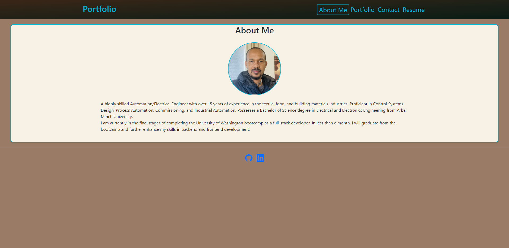
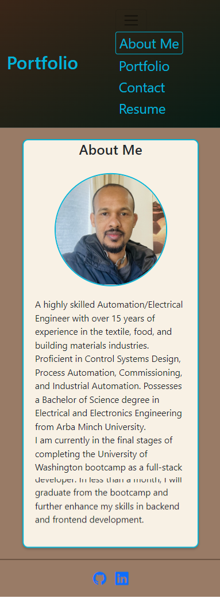

# Full-Stack-Fusion

## Table of Contents
- [Description](#description)
- [Usage](#usage)
- [Credits](#credits)
- [License](#license)

## Description

The goal of this project is to build a portfolio based on a user story provided on UW bootcamp Module 20 chalenge. Full content of user story and acceptance criteria is listed under github issue#1 of this repasatory.
The website will have a header which contains navigation links to different part of contents which are "about me" , "Portfolio" , "Contact" and "Resume". 

## Usage
When portfolio is loaded developer name is presented on the header along with navigation links to "About Me" , " Portfolio" , "Contact" and "Resume". When each links are clicked it leads to corosponding section. A recent photo of the developer will be presented on "About me " section. Pictures of applecations are presented at "work" section. When hovering on each pictures it grows by 5% and it leads to to application in new tab when clicked(Currently it only leads to pdf link). The site is responsive to different screen size.

[This demo vedio](assets/videos/Demo_Video.webm) shows the web application's appearance and functionality:

Portfolio picture for computer screan

Portfolio picture for mobile screan

## Credits
I used resorces in UW bootcamp modules .

## License
MIT License

Copyright (c) 2023 GET

Permission is hereby granted, free of charge, to any person obtaining a copy
of this software and associated documentation files (the "Software"), to deal
in the Software without restriction, including without limitation the rights
to use, copy, modify, merge, publish, distribute, sublicense, and/or sell
copies of the Software, and to permit persons to whom the Software is
furnished to do so, subject to the following conditions:

The above copyright notice and this permission notice shall be included in all
copies or substantial portions of the Software.

THE SOFTWARE IS PROVIDED "AS IS", WITHOUT WARRANTY OF ANY KIND, EXPRESS OR
IMPLIED, INCLUDING BUT NOT LIMITED TO THE WARRANTIES OF MERCHANTABILITY,
FITNESS FOR A PARTICULAR PURPOSE AND NONINFRINGEMENT. IN NO EVENT SHALL THE
AUTHORS OR COPYRIGHT HOLDERS BE LIABLE FOR ANY CLAIM, DAMAGES OR OTHER
LIABILITY, WHETHER IN AN ACTION OF CONTRACT, TORT OR OTHERWISE, ARISING FROM,
OUT OF OR IN CONNECTION WITH THE SOFTWARE OR THE USE OR OTHER DEALINGS IN THE
SOFTWARE.
